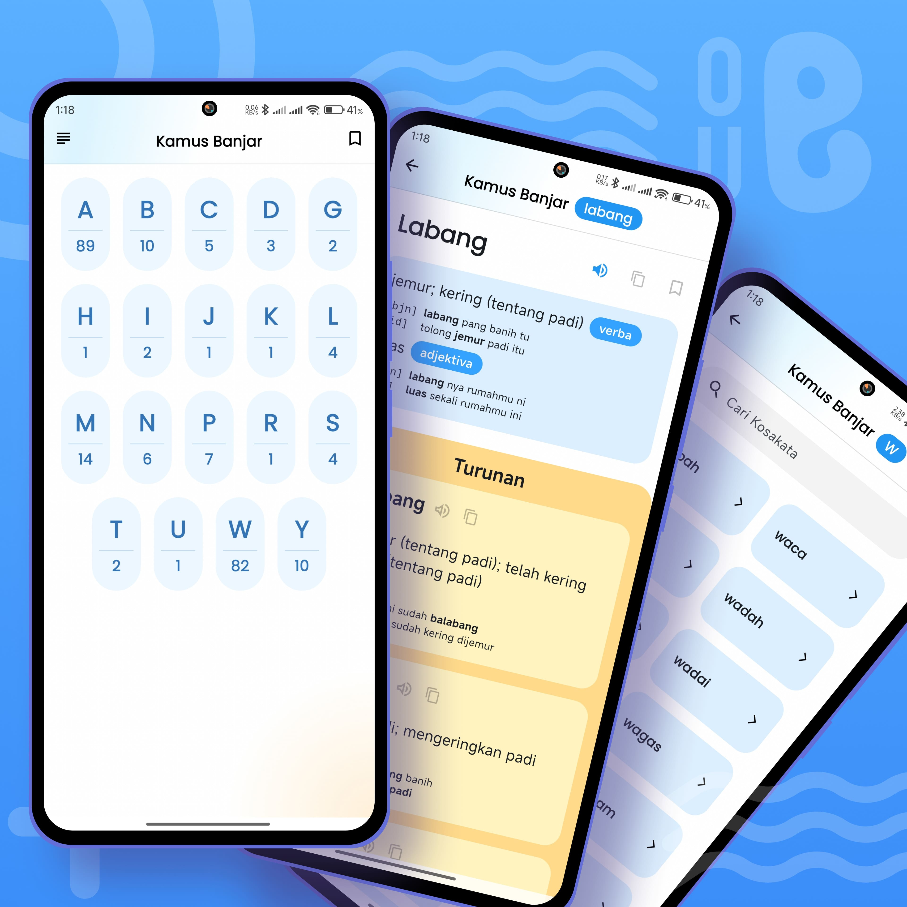
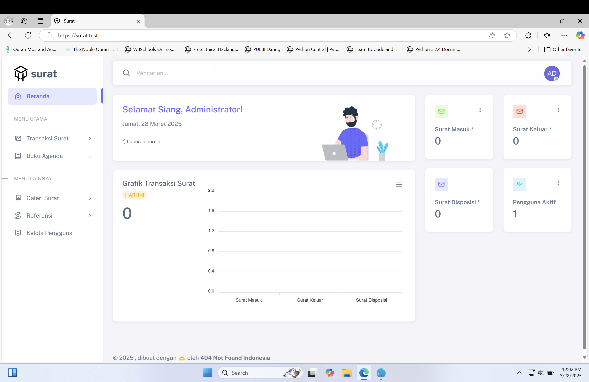
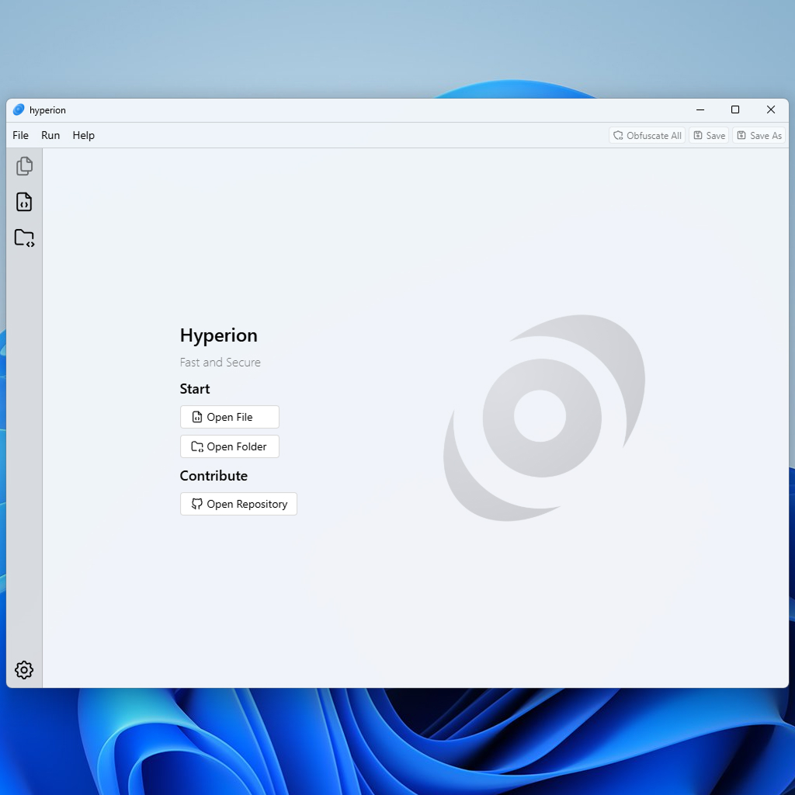

# 404 Not Found Indonesia  

**404 Not Found Indonesia** adalah komunitas yang berfokus pada pengembangan dan berbagi proyek open-source berkualitas tinggi. Kami menggunakan berbagai teknologi dan pendekatan inovatif untuk menciptakan solusi yang dapat membantu developer di seluruh dunia. 

English

_**404 Not Found Indonesia** is a community focused on developing and sharing high-quality open-source projects. We utilize various technologies and innovative approaches to create solutions that help developers worldwide._

 

🔗 [404notfound.fun](https://404notfound.fun/)  

---  

## 🚀 Open-Source Projects  

### ✅ Completed  

-   **[Kamus Banjar Mobile App](https://github.com/404NotFoundIndonesia/kamus-banjar-mobile-app)**  
    _Kamus Banjar is a mobile application designed to provide users with a comprehensive dictionary of the Banjar language. The app will allow users to search for Banjar words, view their meanings in Indonesian, and access additional linguistic information._
    
-   **[Laravel Laundry App v1](https://github.com/404NotFoundIndonesia/laravel-laundy-app-v1)**  
-   **[Laravel Surat Menyurat v1](https://github.com/404NotFoundIndonesia/laravel-surat-menyurat-v1)**  
    _Aplikasi disposisi surat masuk dan keluar berbasis web menggunakan Laravel 9._  
    
-   **[Aplikasi Pembayaran SPP](https://github.com/404NotFoundIndonesia/aplikasi-pembayaran-spp)**  
    _Aplikasi pembayaran SPP untuk UJK RPL 2022/2023._  
-   **[EasyNote Backend Go](https://github.com/404NotFoundIndonesia/easynote-backend-go)**  
    _Backend aplikasi catatan sederhana dengan fitur keamanan dan kemudahan pengelolaan._  
-   **[Luber Jurdil](https://github.com/404NotFoundIndonesia/luber-jurdil)**  
    _Game Android 2D yang mensimulasikan proses pemungutan suara di TPS untuk meningkatkan edukasi pemilih._  

### 🔄 In Progress  

-   **[Hyperion](https://github.com/404NotFoundIndonesia/hyperion)**  
    _Hyperion is a lightweight yet powerful obfuscator designed to make your code harder to analyze and reverse-engineer. By transforming code structure without affecting functionality, Hyperion helps protect intellectual property and enhance security against tampering._ 
     
-   **[Taskita](https://github.com/404NotFoundIndonesia/taskita)**  
    _Aplikasi manajemen tugas berbasis web untuk meningkatkan produktivitas._  
-   **[Raktrek](https://github.com/404NotFoundIndonesia/raktrek)**  
    _Sistem informasi perpustakaan untuk memudahkan eksplorasi katalog, peminjaman buku, dan manajemen perpustakaan._  
-   **[FixIT Hub](https://github.com/404NotFoundIndonesia/fixit-hub)**  
    _Platform manajemen layanan HP & laptop dengan fitur canggih untuk meningkatkan efisiensi bisnis servis._  
-   **[Math Rizz](https://github.com/404NotFoundIndonesia/math-rizz)**  
    _Platform e-learning matematika interaktif untuk siswa SMA._  
-   **[Simptakan Laravel](https://github.com/404NotFoundIndonesia/simptakan-laravel)**  
    _Sistem informasi perpustakaan modern berbasis web._  
-   **[Tuhfah WebApp](https://github.com/404NotFoundIndonesia/tuhfah-webapp)**  
    _Sistem informasi dan manajemen untuk Taman Pendidikan Al-Qur'an (TPA/TPQ)._  
-   **[Quadra Learn](https://github.com/404NotFoundIndonesia/quadra-learn)**  
    _Media pembelajaran interaktif berbasis web tentang fungsi kuadrat untuk kelas X._  
-   **[Laravel 11 Sneat Template](https://github.com/404NotFoundIndonesia/laravel-11-sneat-template)**  
    _Template Laravel 11 dengan autentikasi Breeze dan terintegrasi dengan dashboard Sneat._  

---  

## 🛒 We Sell  

🚀 Butuh solusi khusus untuk proyek Anda? Kami juga menyediakan layanan pengembangan dan customisasi aplikasi. Hubungi kami melalui [404notfound.fun](https://404notfound.fun/) untuk informasi lebih lanjut!  
